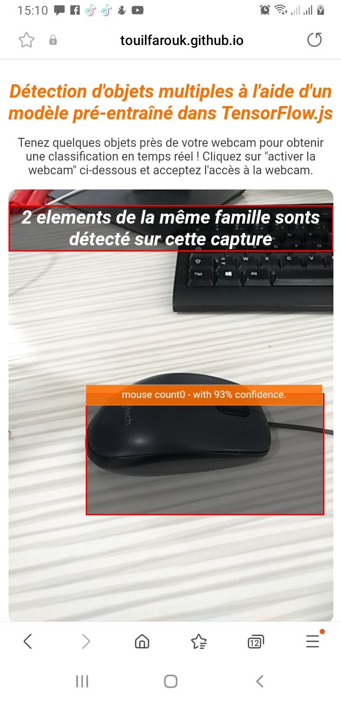
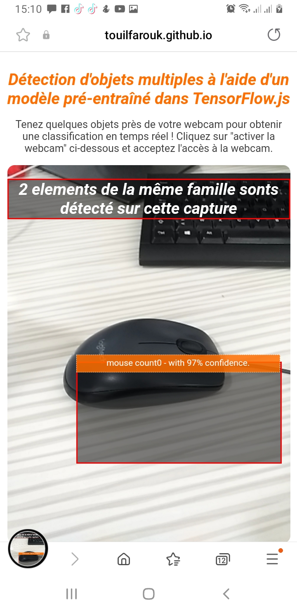
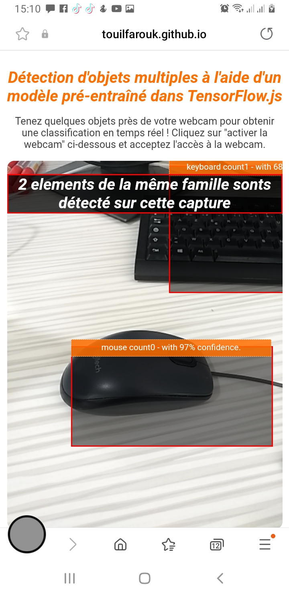

# 📱 Mobile Detection

**Détection d'objets multiples à l'aide d'un modèle pré-entraîné dans TensorFlow.js**

## 🔍 Aperçu

Tenez quelques objets près de votre webcam pour obtenir une classification en temps réel !  
Cliquez sur **"Activer la webcam"** ci-dessous et acceptez l'accès à la webcam lorsque votre navigateur le demande.

## 📷 Aperçu Mobile

| Niveau Mobile 1 | Niveau Mobile 2 | Niveau Mobile 3 |
|------------------|------------------|------------------|
|  |  |  |

## 📝 Licence

Ce projet est sous licence **MIT**.
